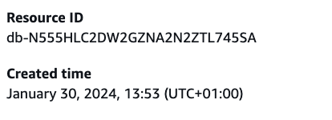

# kubernetes-to-aws-examples

Examples on how to create IAM Policies and use it with our CapabilityAccessFromKubernetes IAM Role.

## Terraform examples

### Covers the following use cases

- Discovery of RDS databases. Either directly or through RDS Proxies.
- Connect to RDS databases.
- Read from AWS Secrets Manager.
- Read from AWS SSM Parameter Store.
- Read and write to AWS S3 bucket.

All policies aim to provide least privileged access.

### Tested with

```bash
tofu version
OpenTofu v1.11.1
on darwin_arm64
+ provider registry.opentofu.org/hashicorp/aws v6.28.0
```

## Kubernetes example

In the file k8s/serviceaccount.yaml you need to change `<account-id>` to your actual numeric AWS account-id.
In both deployment.yaml and serviceaccount.yaml you need to change `<capability-namespace>` to your actual namespace

**Then apply it to Kubernetes:**

```bash
kubectl apply -k k8s/
```

**Start as shell inside the pod:**

```bash
kubectl -n <capability-namespace> get pods
kubectl -n <capability-namespace> exec --stdin --tty <pod-name> -- /bin/bash
```

**Test that you are logged on to AWS through the serviceaccount used by the pod:**

```bash
aws sts get-caller-identity
```

## Least privileged

Ideally you should have a 1:1 relationship between your Kubernetes Deployment, your Kubernetes ServiceAccount and your IAM role.

We have however only pre-created one role for you in your capability account. That IAM role is called CapabilityAccessFromKubernetes.
Use that as inspiration for the roles you create on your own for similar purposes.

You can use the following Terraform code to get the correct trust policy to use in your own roles:

```hcl
data "aws_iam_role" "capability_access_role" {
    name = "CapabilityAccessFromKubernetes"
}

locals {
    service_account_for_service_1 = "capability-access-service-1"
}

resource "aws_iam_role" "my_role_1" {
  name               = "my-role-for-service-1"
  assume_role_policy = replace(data.aws_iam_role.capability_access_role.assume_role_policy, "capability-access", local.service_account_for_service_1)
}
```

## Variables explained

### prefix

Providing a value for prefix ensure that all your policies gets unique names, and hence you can have several similar, but not identical policies.

### rds_resource_id

An AWS RDS instance has a unique resource id. You can find this value on the RDS instance's Configuration page:


